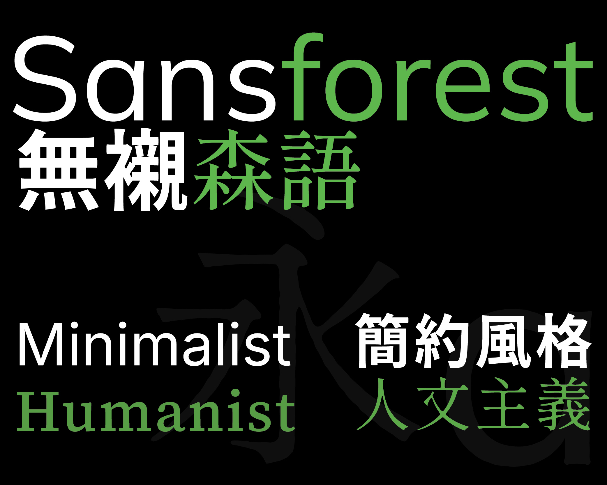
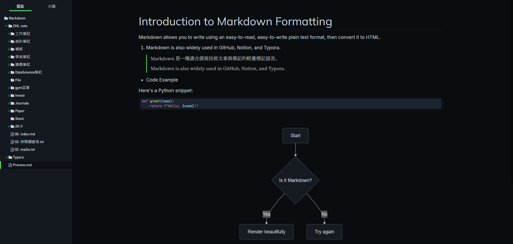

# Sansforest　無襯森語

## English | [繁體中文](README_TC.md)

> A dark, elegant and minimalist Typora theme inspired by GitHub Dark.

## 📧Features

- 🖤 Dark mode with green accent (`#55c95f`)
- 🧠 Traditional Chinese support

## 📥 Installation

1. Download `sansforest.css`, `sansforest_day`, and `sansforest` from [Github Release Page](https://github.com/obscurefreeman/typora_theme_blackout/releases)
2. Put them into Typora's `themes/` directory
3. In Typora, go to `Theme` and select `sansforest`

Licensed under the MIT License.