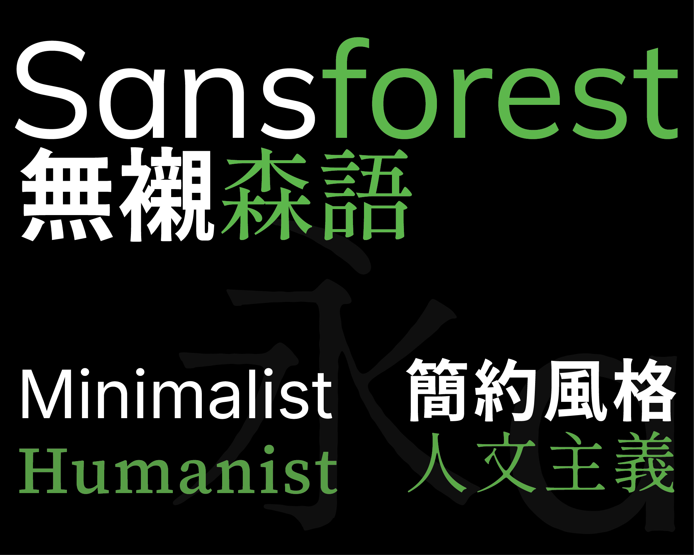

# Sansforest　無襯森語

## [English](README.md) | [繁體中文]

> 暗色、簡潔，精心設計的簡約 Typora 主題，受到 Github Dark 啟發。

## 📥 Installation

1. 下載 `sansforest.css`, `sansforest_day`和 `sansforest` 資料夾 [Github Release Page](https://github.com/MullerLi/Sansforest_typora_theme/releases/tag/v1.0.0)
2. 放入 Typora 的 `themes/` 資料夾下
3. 在 Typora 中，選擇 `主題` → `sansforest`

Licensed under the MIT License.
